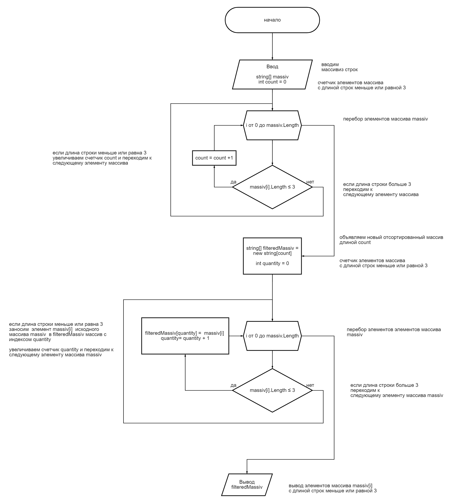

1.**Создал репозиторий (https://github.com/nikolamake/Results-of-the-verification-work.git)**

2.**Выполнена блок-схема алгоритма:**

3.**Написал программу, решаюую данную задачу.**

4.**Использоваль контроль версий в работе. Делал коммиты при выполнении проверочной работы.**